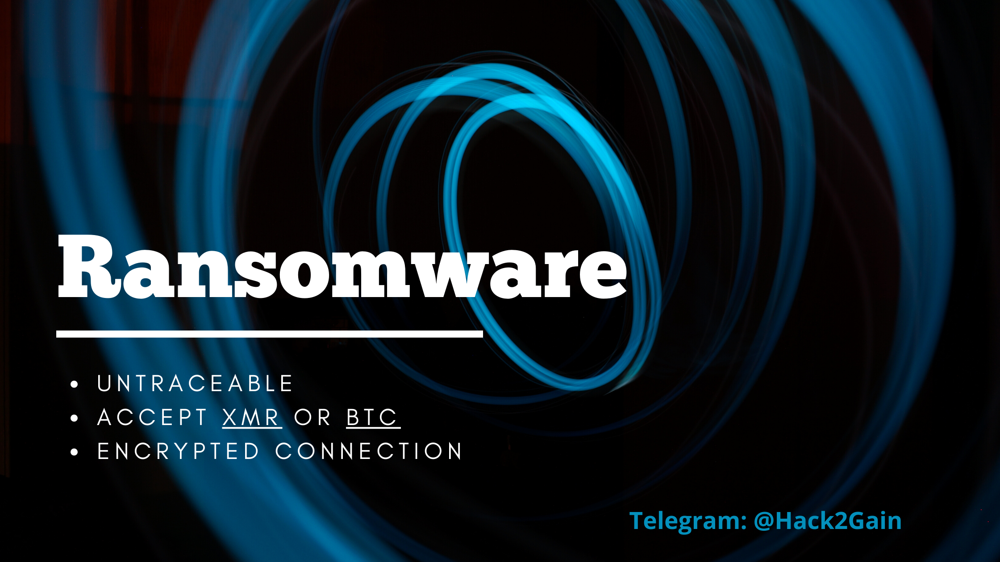
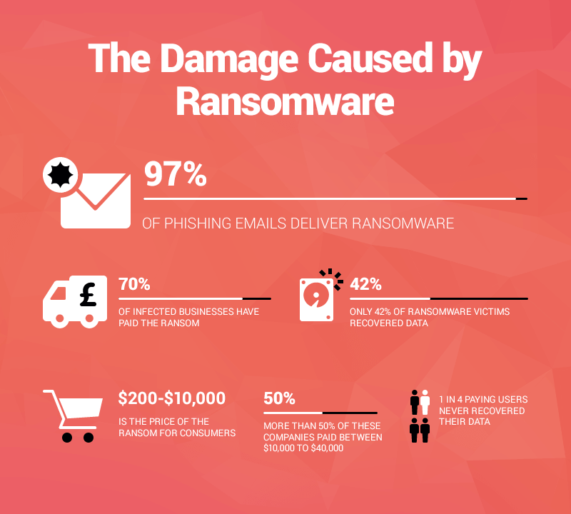

    

-------------

# What's a RansomCryWare?

RansomCryWare is a form of malware that prevent legitimate users from accessing
their device or data and asks for a payment in exchange for the stolen functionality.
They have been used for mass extortion in various forms, but the
most successful seem to be encrypting ransomware: most of the user data are
encrypted and the key can be retrieved with a payment to the attacker.
To be widely successful a ransomware must fulfill three properties:

**Property 1**: The hostile binary code must not contain any secret (e.g. deciphering
keys). At least not in an easily retrievable form, indeed white box cryptography
can be applied to ransomware.

**Property 2**: Only the author of the attack should be able to decrypt the
infected device.

**Property 3**: Decrypting one device can not provide any useful information
for other infected devices, in particular the key must not be shared among them.

-------------

# Features:

- [x] encrypt all user files with AES-256-CBC.
- [x] Random AES key and IV for each file.
- [x] Works even without internet connection.
- [x] Communication with the server to decrypt Client-private-key.
- [x] encrypt AES key with client-public-key RSA-2048.
- [x] encrypt client-private-key with RSA-2048 server-public-key.
- [x] Change computer wallpaper -> Gnome, LXDE, KDE, XFCE.
- [x] Decryptor that communicate to server to send keys.
- [x] python webserver
- [x] Daemon
- [x] Kill databases

    

_This tool in regulalry maintained to keep up with security patches and OS updates_

## This application is maintained and consistently beats all anti-virus software!

---------------------------------------------------------------
##### This software is for permitted remote access to an Andriod device and should not be used illegally.
###### Telegram @Hack2Gain
